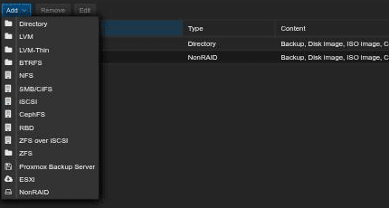
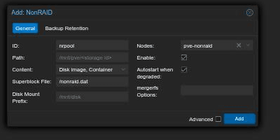
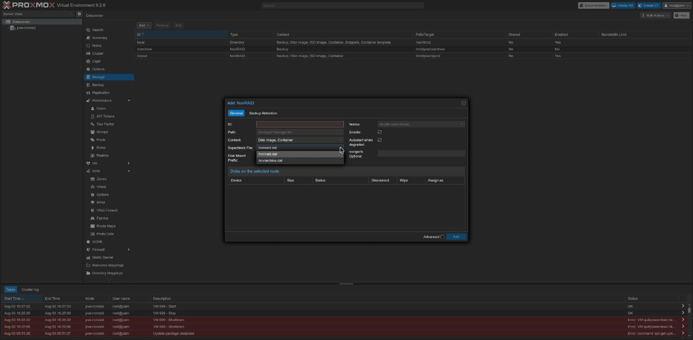
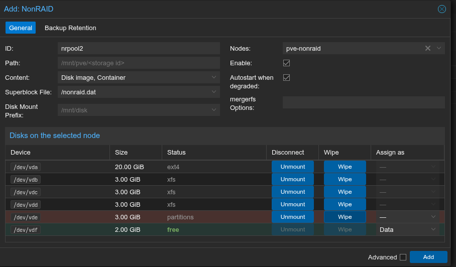
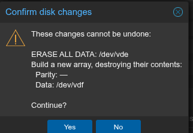
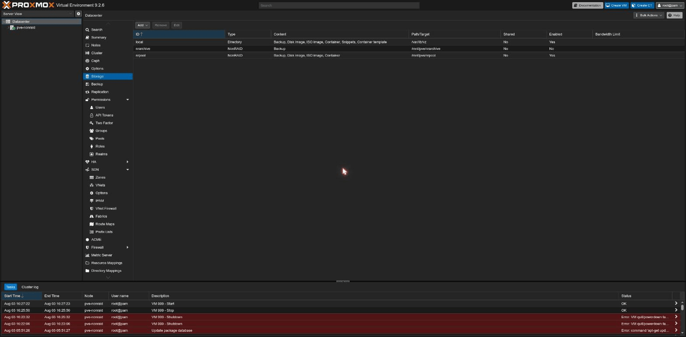
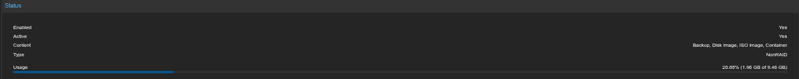

# NonRAID storage plugin for Proxmox VE

Storage type `nonraid` for Proxmox VE 9: on activation the plugin starts the
NonRAID array (`nmdctl start`, degraded states included unless disabled),
mounts the member disks and unions them into a mergerfs pool at the storage
`path`. Array state is read from `/proc/nmdstat` only.

## Install

The plugin `Depends` on `nonraid-tools`, which is in no apt archive — upstream
publishes it as a GitHub release artifact. On a host that does not already have
it, installing the plugin alone therefore fails to resolve, and both packages
have to be built:

```sh
apt install build-essential debhelper fakeroot   # build-time only
( cd tools && dpkg-buildpackage -b -us -uc )     # nonraid-tools
make package-plugin                              # from the repo root, on Debian
apt install ./nonraid-tools_*.deb ./libpve-storage-nonraid-perl_*.deb
```

No synthesis step any more: the systemd/udev copies debhelper expects are
committed under `tools/debian/`, guarded byte-wise against their sources by
`checks/fast.sh`, and `tools/debian/rules` refuses to build if the changelog
version disagrees with nmdctl's `VERSION=`.

Both in one `apt install`: the plugin's dependency is only satisfiable by the
package built alongside it. `.github/workflows/pve-plugin-tests.yml` runs
exactly this sequence, so it stays honest.

The other runtime dependencies are `mergerfs` and a working `nonraid-dkms`
module for the running kernel. The plugin needs nmdctl 1.23 semantics (the
expected-state argument to `start`, and `-u`), but the dependency is
unversioned on purpose: dpkg orders `1.4.0` *below* `1.23`, so the obvious
bound is a trap, and the plugin instead asks `nmdctl --version` at activation
time and refuses anything older than 1.23 semantics. (The changelog now
carries the real version, so a locally built package reports it too.)

## Use

```sh
pvesm add nonraid nrpool --nodes $(hostname) --content images,backup
```

The pool path defaults to `/mnt/pve/<storage id>`. Options:

| option | default | |
|---|---|---|
| `nonraid-super` | `/nonraid.dat` | superblock file (`nmdctl -s`) |
| `nonraid-disk-prefix` | `/mnt/disk` | member mounts (`<prefix><slot>`) |
| `nonraid-degraded-autostart` | `yes` | start DISABLE_DISK/RECON_DISK arrays |
| `nonraid-mergerfs-opts` | computed | mergerfs `-o` override |

Always set `--nodes`: `storage.cfg` is cluster-wide, the array is not. PVE
treats `nodes` as optional for every storage type and this plugin does not
override that, so nothing stops you omitting it — on a cluster the result is
that every other node also tries to activate this storage, runs `nmdctl
import` against a superblock it has no disks for, and fails the activation on
each pvestatd cycle. On a single-node install it is harmless.

The storage stays online while the array is degraded (emulated reads);
transitions are syslogged. `NEW_ARRAY`, `SWAP_DSBL` and `ERROR:*` states are
never started automatically. With `nonraid-degraded-autostart 0` a degraded
array is not started either; the activation error names the manual command.
Note that a freshly created array reports bogus disabled/invalid counters
until the module is reloaded, which with autostart disabled reads as
degraded - reload (or leave autostart on) after creating an array.

Before any manual array ceremony (`unassign`, `replace`, `stop`), run
`pvesm set <id> --disable 1` first: pvestatd re-activates - and therefore
restarts - the array every cycle, and will fight the maintenance. Re-enable
when done.

**To stop the stack, use `systemctl stop pve-nonraid.service`** — not the
individual commands. It unmounts the pools, then the members, then the array,
and only then removes `/var/lib/nonraid/array.running`. That file is the
unclean-shutdown marker: if you tear the array down by hand and leave it
behind, the next activation concludes the node crashed and starts a
*correcting parity check*, which on a real array is hours of I/O. Doing it by
hand means `umount <pool>` for every NonRAID pool, then `nmdctl unmount` and
`nmdctl stop` — and removing `/var/lib/nonraid/array.running` **only if every
one of those succeeded**. If any step failed, leave the marker: the array did
not come down cleanly, which is exactly when the next activation should
re-check parity. `systemctl stop pve-nonraid.service` does all of this for you
and applies that rule itself.

The same marker is why an actual crash does trigger that check on the next
activation — that is the point of it, but it is worth knowing before it
happens at 3am. `nmdctl status` shows the progress.

**Enable the unit (`systemctl enable pve-nonraid`) when guests on a nonraid
storage use onboot**: qemu-server's cloud-init regeneration stats the
cloudinit volume before anything has activated the storage on a cold boot,
and the first `qm start` fails once with "disk image already exists"; the
enabled unit activates the storages before pve-guests runs. Note what
enabling it couples: its ExecStart is `pvesm status`, the canonical
"activate the enabled storages" call, so boot now waits (up to its 100s
bound) on **every** enabled storage on the node, not only this one — an
unreachable NFS server elsewhere delays boot too. If
`nonraid.service` from nonraid-tools is enabled, set `AUTOMOUNT=no` in
`/etc/default/nonraid` and let the plugin mount.

## Web UI

The package injects a script tag into `/usr/share/pve-manager/index.html.tpl`
(pve-manager has no storage-plugin extension point) which adds NonRAID to the
Add Storage menu. A dpkg file trigger re-applies it after pve-manager
upgrades; `/usr/share/pve-nonraid/pve-nonraid-gui status` shows the current
state (the tool is not on `$PATH`). If injection fails the plugin is
unaffected — use `pvesm`.

### Adding a storage

**Datacenter → Storage → Add** gains a NonRAID entry at the bottom of the
list:



The panel asks for the same options as `pvesm`. Only the ID is mandatory to
the *schema*: leave Path empty and it becomes `/mnt/pve/<id>`, and the
remaining fields fall back to the defaults in the table above. **Nodes** is
the exception you should treat as mandatory anyway — set it to the one node
that has the array, for the reason above.



*Autostart when degraded* is on by default, matching the backend. Unchecking
it means a degraded array is not started automatically and activation fails
with the manual command to run — see the fail-stop note above. **mergerfs
Options** replaces the computed defaults; the plugin appends its own
`fsname=` regardless, because the shutdown teardown finds pools by it.

**Superblock File** and **Disk Mount Prefix** are editable dropdowns. They
offer the defaults plus whatever the nonraid storages already configured on
this cluster use — the driver takes its superblock as a module parameter, so
a second storage on the same node needs the same one, and picking it from a
list beats retyping a path. Neither is a closed set: type any path.



### Building an array from the dialog

**Disks on the selected node** lists what that node actually has, with a
`Size` and a `Status` taken from PVE's own disk inventory. Each row has three
staged actions, and they form a funnel — a disk only becomes assignable once
nothing else claims it:

| Column | Does | Enabled when |
|---|---|---|
| Disconnect → *Unmount* | unmounts every filesystem on the disk | nothing else holds it |
| *Wipe* | `wipefs -a` on the whole disk | it has something to erase |
| *Assign as* | stages the disk as **Parity** or **Data** | the disk is empty, or staged for a wipe |

Nothing runs while you click. Pressing **Add** shows one confirmation naming
every disk in every staged action, and only then does the plugin's hook run
them in order: unmount, wipe, create.





**Who may do this, and on which machine.** These actions are node-local and
destructive, so the plugin refuses them unless two things hold:

- the storage names this node in **Nodes** (device names mean nothing on
  another machine, and `POST /storage` is served by whichever node your
  browser is talking to — not necessarily the one whose disks the dialog is
  showing);
- the caller has `Sys.Modify` on `/nodes/<node>`.

The second is deliberate. PVE gates the equivalent operation
(`/nodes/{node}/disks/wipedisk`) at root; these properties arrive on
`POST`/`PUT /storage`, which needs only `Datastore.Allocate`. Going around
that endpoint is necessary — it cannot see NonRAID membership, so a live
array member looks exactly like a spare to it — but the privilege it carried
has to be re-applied here, or delegating "may define storages" would also
delegate "may erase any disk on the node".

**How long it takes.** Creating an array runs `nmdctl create`, `start` and
`check recon` inside the storage-config hook, which holds the cluster storage
lock for the duration. The commands return as soon as the driver accepts them
— the parity build itself runs in the background and is *not* waited for — but
the bounds are generous, so budget up to a couple of minutes and do not
interrupt the API call. The steps run in order (unmount, wipe, create) and are
not replayed: if a later one fails, the earlier ones have already happened and
a retry starts from where the disks now are. The same asymmetry exists one
step later: PVE activates the storage after the create hook, and if that
activation fails it rolls back the *storage definition* — not the array,
which by then is built and syncing. That is deliberate (un-creating an array
is far more destructive than leaving it), so the recovery is to fix whatever
blocked activation and add the storage again, pointing at the now-existing
superblock.

A disabled button carries the reason as a tooltip. Ceph OSDs, LVM, ZFS and
Device Mapper are refused outright rather than unmounted — release those with
the tool that owns them.

**The browser is not the authority here.** The node re-validates every disk
before touching it and refuses array members, system mountpoints (`/`,
`/boot`, `/usr`, …) and anything with a holder, whatever the dialog offered.
That gap is deliberate: array membership lives in `/proc/nmdstat`, which no
PVE API exposes, so a live member is indistinguishable from a partitioned
spare in the browser. Unmount and Wipe therefore stay enabled on disks the
node will refuse — the refusal comes back as the task error.

Creating from here needs a node with no array loaded; the driver takes its
superblock as a module parameter and holds one array. To *add* disks to an
array that already exists, use `nmdctl add` (see the note on manual ceremony
above). The slot-to-disk mapping is likewise `nmdctl status` territory: it is
not part of the storage configuration.

### After it is added

The storage appears with type **NonRAID**. It is created immediately; if
`pve-nonraid.service` is not enabled it then activates only when something
first uses it, and that activation is what starts the array and mounts the
pool. With the unit enabled (see above), activation instead happens at boot,
before `pve-guests`.



Selecting it shows the usual Summary. *Active: Yes* means the array is
started, the members are mounted and the mergerfs pool is up; the usage
figures are the pool's, i.e. the sum of the data disks.



Editing works the same way, with ID and Path shown read-only. Without the GUI
script loaded, clicking Edit on an existing nonraid storage throws
`no editor registered for storage type: nonraid` (that click only) — the
storage itself keeps working.

## Kernel upgrades

The plugin cannot start the array if DKMS has no module for the running
kernel. Keep the matching `proxmox-headers-*` installed and check
`dkms status` after kernel upgrades.

## Tests

```sh
prove pve-plugin/t/                 # pure helpers and orchestration argv
sh pve-plugin/t/tpl-roundtrip.sh    # GUI injection round-trip
sh pve-plugin/t/teardown.sh         # shutdown teardown, incl. failure paths
```

`perl -c` on the plugin is a false negative (compile cycle through the
DirPlugin parent); CI loads it through `PVE::Storage` on real PVE 9 packages.

Verified end to end on a PVE 9.2.6 node (kernel 6.14.11-9-pve, nonraid-dkms
1.3.2, mergerfs 2.40.2, 4-disk virtio array): plugin-driven start/mount/pool
from a cold array; degraded autostart with parity-emulated reads (md5-clean
through mergerfs); the fail-stop refusal; a full unassign/replace/RECON_DISK
rebuild; a guest with `cache=none,aio=native` qcow2 on the pool surviving
reboots with data intact, plus qcow2 snapshot/rollback; ordered shutdown
teardown; the dpkg trigger on a pve-manager reinstall; the Add/Edit dialogs
in a real browser; a purge/reinstall cycle (config and running guests
survive, `pvesm` degrades to an "unsupported type" warning); and the same
stack rebooted onto PVE's default kernel line - 7.0.14-8-pve with
nonraid-dkms 1.4.0 - with the array, pool, guest and all payloads intact.

Parity-check impact, measured on that rig (virtual disks - deltas are
directional only): guest streaming reads dropped ~40% while the check ran,
direct writes ~10%, and 4k fsync latency was unchanged. Untested:
multi-node clusters.
